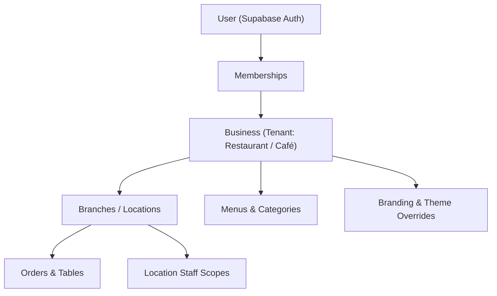

# Darb REST: System Architecture Blueprint

## 1. Project Purpose & Scope

**Darb REST** is an independent, multi-tenant digital restaurant and café engine under the Darb brand family. It powers digital menus, QR ordering, takeaway, table service, and full back-of-house operations.

Future public domain:
`https://rest.darb.co.il`

### Independence Principle

Darb REST is **not** a sub-module inside a monolithic Darb dashboard. REST operates as its own dedicated product:

- Independent Git repository and deployment pipelines
- Dedicated frontend application (`apps/web`)
- Dedicated administrative console (`apps/admin`)
- Dedicated Supabase backend instance with isolated Row Level Security (RLS)
- Dedicated tenant onboarding, billing plans, and customer experiences

---

## 2. Monorepo Organization

The project is configured using **pnpm workspaces** and **Turborepo 2**:

```
Darb_Rest/
├── apps/
│   ├── web/                     # Customer-facing public application (Next.js 16 App Router)
│   └── admin/                   # Business administration dashboard (Next.js 16 App Router)
├── packages/
│   ├── config/                  # Base TypeScript configs, ESLint configs, env helpers, constants
│   ├── design-tokens/           # Central visual design tokens & CSS custom properties
│   ├── i18n/                    # Multilingual engine (Arabic, Hebrew, English) with RTL support
│   ├── icons/                   # Centralized Lucide SVG abstraction (strictly NO emojis)
│   ├── supabase/                # Supabase client, SSR server client, and admin service-role utilities
│   ├── types/                   # Multi-tenant domain models, roles, plans, and API contracts
│   ├── ui/                      # Accessible design system primitives (Button, Card, Modal, etc.)
│   └── validation/              # Zod validation schemas for tenant, business, and locations
├── docs/
│   ├── ARCHITECTURE.md          # Architectural blueprints and patterns (this file)
│   └── PROGRESS.md              # Project status, milestones, and phase tracking
├── e2e/                         # Monorepo-wide Playwright E2E smoke test suite
├── package.json                 # Root scripts and workspace devDependencies
├── pnpm-workspace.yaml          # Workspace declarations
├── turbo.json                   # Turborepo task pipeline configuration
└── README.md                    # Repository overview and quickstart guide
```

---

## 3. Application Responsibilities

### `apps/web` (Public REST Application)

- **Domain**: `rest.darb.co.il` (and tenant sub-paths like `rest.darb.co.il/[business-slug]`)
- **Audience**: Restaurant & café customers, visitors, and diners.
- **Responsibilities**:
  - Digital menu viewing
  - QR code landing and dine-in table ordering
  - Takeaway and pickup ordering
  - Business discovery and public landing pages
  - Dynamic tenant theme rendering (primary brand colors, hero covers, logos)
  - Full mobile-first optimization (designed for quick dining encounters)

### `apps/admin` (REST Business Dashboard)

- **Domain**: `admin.rest.darb.co.il` (or business console portal)
- **Audience**: Business owners, general managers, kitchen staff, and authorized operators.
- **Responsibilities**:
  - Business profile and branch location management
  - Digital menu authoring (categories, items, modifiers, pricing)
  - Live order management & kitchen displays
  - Visual branding and theme customization
  - Staff role assignment and permission controls
  - Performance analytics and plan entitlements

---

## 4. Multi-Tenant Architecture

REST is built from day one as a **true multi-tenant system**. No component or query assumes a single hardcoded restaurant or single branch.

### Entity Hierarchy



### Role Hierarchy & Permissions

1. `platform_super_admin`: Full system-level oversight across all tenants.
2. `business_owner`: Full administrative and commercial control over their business and all branches.
3. `business_admin`: Operational management over all branches, menus, and branding (excluding billing).
4. `manager`: Branch-level operational control (menus, active orders, operating hours).
5. `staff_editor`: Menu updates and live order processing.
6. `read_only`: Reporting and read-only viewing permissions.

### Unified Restaurant & Café Engine

Restaurants and cafés share the same unified REST core. Differences in workflow (e.g. coffee counter ordering vs. multi-course table service) are configured via:

- `business.type` (`'restaurant'` or `'cafe'`)
- Configurable settings flags (`allowTableOrdering`, `allowTakeaway`)
- Layout presets and theme variations

---

## 5. Internationalization & Typography Strategy

REST is multilingual from day one, serving three primary languages:

1. **Arabic (`ar`)**: RTL direction, typography powered by **Cairo**
2. **Hebrew (`he`)**: RTL direction, typography powered by **Heebo**
3. **English (`en`)**: LTR direction, typography powered by **Ubuntu**

### Implementation Rules

- **Next.js Font Optimization**: Fonts are imported using `next/font/google` and exposed as CSS variables (`--font-cairo`, `--font-heebo`, `--font-ubuntu`). The active font is set dynamically based on the current locale via `--font-active`.
- **CSS Logical Properties**: Layouts, margins, paddings, and borders strictly use CSS logical properties (`start`, `end`, `ms-*`, `me-*`, `ps-*`, `pe-*`, `border-s`, `border-e`).
- **Zero Hardcoded Strings**: No user-facing text is written directly into TSX components. All strings must be fetched using `t("category.key")` from `@darb-rest/i18n`.
- **Direction-Aware Icons**: Directional icons (`ArrowStart`, `ArrowEnd`, `ChevronStart`, `ChevronEnd`) flip automatically to preserve correct spatial semantics across RTL and LTR.

---

## 6. Design System & Token Strategy

### Token Architecture

Design tokens are centralized in `packages/design-tokens` and exposed as CSS custom properties (`tokens.css`) consumed by Tailwind CSS v4.

Tokens cover:

- Surface and canvas backgrounds
- Foreground typography colors and contrast hierarchies
- Semantic status colors (success, warning, destructive, info)
- Spacing scales, border radii, and elevation shadows

### Tenant Theme Customization

Platform typography and structural component layouts are strictly controlled to ensure premier aesthetic standards. Businesses customize their brand experience via controlled CSS variable injections:

- `--tenant-primary`: Main brand accent color
- `--tenant-accent`: Secondary decorative color
- `--tenant-cover-overlay`: Hero banner dimming overlay
- Custom logo and cover banner URLs

### Zero-Emoji Policy

**Emojis are strictly prohibited in the product UI.** Statuses, navigation items, category indicators, and placeholders must strictly use high-quality SVG vector icons provided by `@darb-rest/icons` (Lucide SVG wrappers).

---

## 7. Supabase Architecture & Security

Supabase provides authentication, PostgreSQL database, storage, and realtime subscriptions.

### Client Separation

- **`createBrowserClient`**: Client-side singleton for interactive browser components (`@darb-rest/supabase/client`).
- **`createServerClient`**: Async server client utilizing Next.js cookies for Server Components, Route Handlers, and Server Actions (`@darb-rest/supabase/server`).
- **`getAdminClient`**: Privileged service-role client. Strictly restricted to server runtimes (`@darb-rest/supabase/admin`). Throws an explicit error if invoked in a client-side bundle.

### Data Isolation & Row-Level Security (RLS)

All tenant-scoped tables are secured using PostgreSQL Row Level Security (RLS) policies:

- **Strict Tenant Boundaries**: Queries are filtered against `business_id` and verified user memberships.
- **Recursion Avoidance**: Helper functions (`is_platform_admin()`, `has_business_role()`, `has_any_business_role()`) are defined with `SECURITY DEFINER` and explicitly pinned `SET search_path = public, auth` to query membership tables safely without triggering recursive policy loops.
- **Last-Owner Protection**: The database enforces `prevent_last_owner_removal()` trigger, preventing deletion or role demotion if a business would be left with zero active owners.

### Next.js 16 Proxy Convention

In Next.js 16.3+, the deprecated `middleware.ts` convention is replaced by `proxy.ts`:

- Both `apps/web` and `apps/admin` utilize `proxy.ts` exporting a `proxy(request)` function.
- `proxy.ts` handles locale routing and public static bypass.
- Heavy authentication and multi-tenant resolution are cleanly decoupled from the edge proxy and executed via Server Components and layout guards (`apps/admin/lib/tenant-resolver.ts`).

---

## 8. Plans & Entitlement Precedence Engine

REST implements a three-tier precedence engine for commercial feature gating:

```
Business Feature Override > Plan Entitlements > System Default Fallback
```

Features governed by plans include:

- `digital_menu`
- `qr_codes`
- `online_ordering`
- `table_ordering`
- `takeaway`
- `online_payments`
- `advanced_analytics`
- `custom_domains`
- `custom_branding`
- `multi_location`

The resolver evaluates numeric limits and boolean flags centrally via `resolveEntitlements()`, providing callers with unified resolved capabilities without scattered plan checks.

---

## 9. Development Commands & CI Scripts

Run from the repository root:

| Command             | Action                                                                     |
| ------------------- | -------------------------------------------------------------------------- |
| `pnpm dev`          | Start both `apps/web` (port 3000) and `apps/admin` (port 3001) in parallel |
| `pnpm build`        | Run Turborepo production build across all packages and applications        |
| `pnpm lint`         | Execute ESLint flat checks across the workspace                            |
| `pnpm typecheck`    | Strict TypeScript type validation without emitting code                    |
| `pnpm test`         | Run Vitest unit suites for packages                                        |
| `pnpm test:e2e`     | Run Playwright end-to-end smoke tests against web and admin shells         |
| `pnpm format`       | Run Prettier across all source files                                       |
| `pnpm format:check` | Check code formatting compliance                                           |

---

## 10. Business & Branch Onboarding Lifecycle (Phase 3)

### 7-Step Onboarding Wizard

1. **Business Identity**: Business name in primary/alternate languages, slug reservation/suggestion, optional legal name.
2. **Type & Locale**: Restaurant vs. Café & Roastery classification, default public language (`ar`, `he`, `en`), operating timezone (default `Asia/Jerusalem`), operating currency (default `ILS`).
3. **Contact & Branding**: Public phone, email, website, Instagram, Facebook, and primary/accent brand colors.
4. **First Branch**: Initial location name, branch slug, physical address line, city, country, optional GPS coordinates.
5. **Weekly Operating Hours**: 7-day normalized schedule (Monday through Sunday) with open/close intervals and closed day toggling.
6. **Commercial Plan**: Real database-driven plan tier selection (`starter`, `pro`, `enterprise`) with previewed feature entitlements.
7. **Review & Confirm**: Summary of all configured parameters with atomic creation launch.

### Safe Resume & Draft Persistence

- **Minimal Cookie Architecture**: The client cookie `darb_rest_onboarding_draft` stores strictly minimal session state: `{ draftId: string, currentStep: number }`. No sensitive or meaningful business/branch data is stored in client cookies.
- **Server-Side Draft Persistence**: Actual onboarding draft form data (business identity, legal name, slug, contact details, branch location, hours, selected plan) is persisted server-side in Supabase (`public.onboarding_drafts`).
- **Single Draft Constraint**: Enforces `UNIQUE (user_id)` to avoid duplicate draft businesses per owner.
- **Cross-Session & Cross-Device Resumption**: When an authenticated user accesses the onboarding flow from a new session or device (or if the client cookie is cleared), the server detects their existing draft in Supabase and renders an interactive Resume Setup banner with their previously completed step and saved data preserved.
- **Atomic Cleanup**: When `completeOnboarding` is invoked, the draft record is cleared server-side from Supabase and the client cookie is removed upon atomic business creation.

### Immediate Tenant & Branch Resolution

- Upon completion, the creator is assigned the `owner` role via server-validated identity (`auth.uid()`).
- The newly created business ID and primary location ID are immediately set in active tenant session cookies (`darb_rest_active_business`, `darb_rest_active_location`), transitioning directly into the dashboard without requiring manual logout or re-login.

### Post-Onboarding Management

- **Locations (`/locations`)**: View branches, add new branches with plan quota enforcement (`entitlements.multi_location.limitValue`), edit branch details, and switch active branch.
- **Settings (`/settings`)**: Edit business identity, contact information, and branding colors with RBAC restriction (`owner` / `admin` only).

## Restaurant content core (Phase 4)

Business-owned menus are reused across branches through assignments; branch-specific behavior
is stored in nullable overrides. The admin content service uses real authenticated Supabase
reads and mutations, a bounded transactional RPC for related changes, and private optimized
media. The shared UI package contains the responsive guest-style preview.

See [MENU-ARCHITECTURE.md](./MENU-ARCHITECTURE.md) for prices, multilingual content, permissions,
query boundaries, media lifecycle and local integration testing. Ordering is described below.

## Ordering core (Phase 5)

The public web app now resolves business/branch slug routes for account-free ordering. A shared
client cart/configurator powers that route and the separate owner preview. Authoritative
PostgreSQL validation creates drafts and submitted snapshots; tenant-protected admin routes
list orders and manage the defined status transitions. Public projections and guest capability
checks keep administrative data private.

Details: [ORDER-ARCHITECTURE.md](./ORDER-ARCHITECTURE.md).

## Checkout and payment foundations (Phase 6)

Guest checkout atomically links server-validated orders to payment intents. A server-runtime provider
interface supports gateway adapters; only a local test provider is installed, and production online
payments remain unavailable. Signed, idempotent callbacks drive payment status independently from
fulfillment. Tenant RLS and guest capability checks protect payment reads and collection actions.

See [PAYMENT-ARCHITECTURE.md](./PAYMENT-ARCHITECTURE.md). Migration 6 is local-only pending operator
application; no remote database changes were executed in Phase 6.

## Tables and QR context (Phase 7)

Restaurant tables belong to a business and branch. Separate, revocable QR capabilities resolve into
the existing public ordering flow. QR-aware server transactions validate branch/table state before
pricing and preserve table snapshots on dine-in orders; takeaway remains independent. Admin pages
manage tables and generate branded printable cards and image downloads.

See [TABLE-QR-ARCHITECTURE.md](./TABLE-QR-ARCHITECTURE.md). Migration 7 awaits operator application;
no local or remote migration was executed in Phase 7. Kitchen/KDS remains out of scope.

## Phase 8 kitchen operations

The admin kitchen board uses a branch-scoped projected order feed, authenticated minimal Realtime
signals and polling recovery. Canonical order transitions remain authoritative beneath an audited,
idempotent operation RPC. See [KDS-ARCHITECTURE.md](./KDS-ARCHITECTURE.md) for the security boundary,
recovery behavior and completed local integration validation.

## Phase 9 restaurant operations

The operations workspace composes the existing KDS with branch stations, task routing, service
assignments and table states. Its RPCs preserve canonical order/payment transitions and publish
only minimal branch signals. Printer support is a versioned event/adapter foundation with no
physical integration. See [RESTAURANT-OPERATIONS.md](./RESTAURANT-OPERATIONS.md).

## Phase 10 public restaurant templates

A growing presentation registry renders the shared restaurant/menu model. Public slug and existing
QR/order entry points reuse the same cart, server totals and checkout engine. Private real-data
previews and versioned draft/public appearance snapshots power the admin template editor.
See [TEMPLATE-ARCHITECTURE.md](./TEMPLATE-ARCHITECTURE.md).
